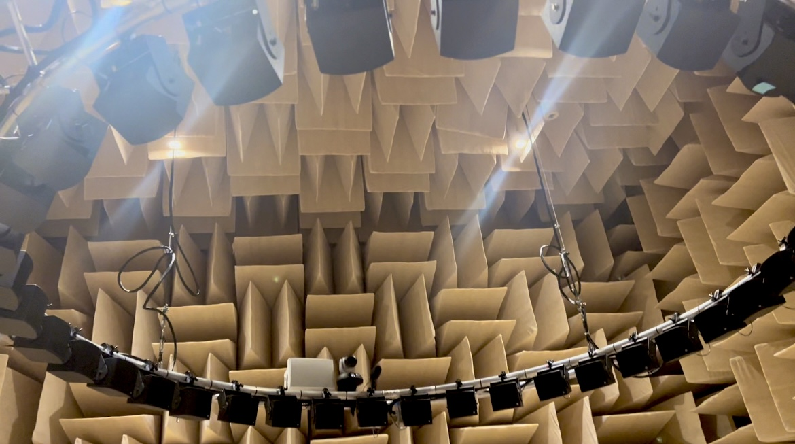
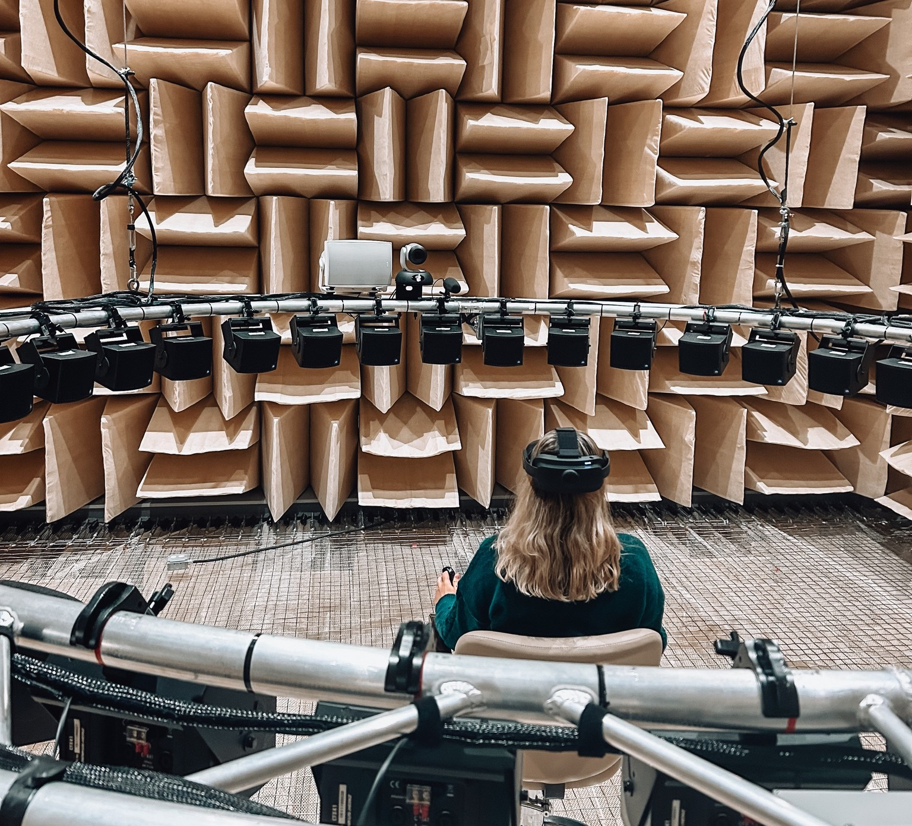

# Phase Array Characterization Experiments in UM Anechoic Chamber 



## Overview


## Installation and Setup

### Prerequisites
- Python: Download and install Python from [Python Downloads](https://www.python.org/downloads/). Ensure you add Python to your system's PATH during the setup.

### Setting Up the Environment
1. **Check Python Installation**:
   - Open Terminal.
   - Check Python installation:
     ```
     python
     exit()
     ```
3. **Download Repo**:
   ```
   git clone https://github.com/kevmck451/anechoic_um_app
   ```
4. **Navigate to Your Project Directory**:
   ```
   cd Desktop/anechoic_um_app
   ```
5. **Create and Activate a Virtual Environment**:
   - Create:
     ```
     python -m venv myenv
     ```
   - Activate:
     ```
     myenv\Scripts\activate
     ```
   - If you encounter a permission issue in PowerShell:
     ```
     Set-ExecutionPolicy Unrestricted -Scope Process
     .\myenv\Scripts\Activate.ps1
     ```
   - To deactivate:
     ```
     deactivate
     ```
6. **Install Required Packages**:
   ```
   pip install -r requirements.txt
   ```
7. **Export Requirements** (if needed):
   ```
   pip freeze > requirements.txt
   ```

### Running the Application
- **On a Mac Computer**:
  - Run the app from the `anechoic_um_app` directory:
    ```
    python3.7 -m app.app_main
    ```
- **On a Windows Computer**:
  - Run the app from the `anechoic_um_app` directory:
    ```
    python .\app\app_main.py
    ```
- **On the Anechoic Chamber Computer**:
  - Navigate to the `anechoic_um_app` directory:
    ```
    python -m app.app_main
    ```


# Brainstorming


## Goals of Characterization
    - Beamforming Lobes
      - characterize lobes all 5 center output channels (2d)
      - play 2kHz signal in 360 and map the signals amplitude or small windowed rms

    - Frequency Response
      - play white noise in 360 and see frequency response as it sweeps through

    - need to keep up with angle of sound being played as time progresses 

    - need to get frequency response of the speakers 

    - maybe also record with hypercardiod mic for comparison


## Experimenet Sequence
    - Select Sound to be Played
      - 2kHz sine wave
      - white noise

    - Start Experiment
      - Timer
      - Angle of sound being played with time
      - way to sweep the sound throughout the array continuously with like triangle function gain

    - Ending beep





